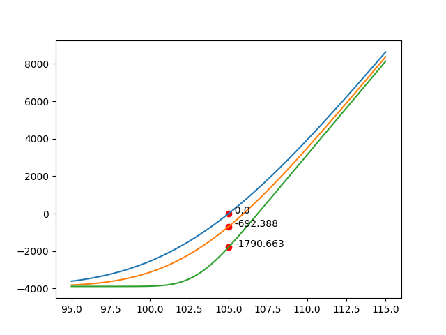

# Option Portfolio


```
-------------------------------------
Portfolio Summary:
-------------------------------------
Long 10 IBM 103 Call Sep 02, 2021 @3.888542041728158
Short 20 IBM 107 Call Sep 02, 2021 @1.8260141394687963
Long 10 IBM 110 Call Sep 02, 2021 @0.9046806871930535
-------------------------------------
Porfolio Delta: 82.801
Porfolio Gamma: -15.724
Porfolio Vega: 4.937282
Porfolio Theta: 8.581792
```
## Features
- Single European option pricing (BSM Model)
- Single option Greeks Calculation
- Single option payoff diagram
- Options portfolio Greeks Calculation
- Options portfolio payoff diagram

## Option Class
```python
class Option:
    symbol: str #underlying symbol
    S: float #underlying price
    K: float #strike price
    T: dt #expiry date
    t: dt #evaluation date
    r: float #risk free rate
    sigma: float #volatility (forecasted)
    type: str #Call/Put
    pos: int = 1 #no of position, use negative number to represent short
    opt_price: float = 1. #actual option price
```

Declaration example:
```python
eval_date = dt.date(2021,8,1)
expiry = dt.date(2021,9,2)
strike_price = 103
underlying_price = 105
pos = 10
opt_price = 3.1

c103ibm = Option("IBM",underlying_price, strike_price, expiry, eval_date, 0.05, 0.20, "Call", 10, opt_price)

print(c103ibm)
```
output:<br>
`Long 10 IBM 103 Call Sep 02, 2021 @3.1`

### Option Summary 
`opt_summary` method will summarized the option's `Time to Expiry`, `Options Theoretical Price`, `Delta`, `Gamma`, and `Vega`. It also shows the corresponding dollar value of the greeks based on the position it holds.

`c103ibm.opt_summary`
<br>
Output:
```
-------------------------------------
Long 10 IBM 103 Call Sep 02, 2021 @3.1
Underlying: 105
Time to expiry: 32 days  (0.089 years)
Theo. Price: 3.889 (3889.0 Total)
Delta: 0.665 (665.0 Total)
Gamma: 0.058 (58.0 Total)
Vega: 0.039669 (39.669 Total)
Theta: -0.044791 (-44.791 Total)
-------------------------------------
```

### Payoff Diagram

```python
c103ibm.opt_price = c103ibm.price()
print(c103ibm)
c103ibm.drawpayoff_diagram(95, 115)
plt.show()
```

Output:
<br>
`Long 10 IBM 103 Call Sep 02, 2021 @3.888542041728158`
<br><br>


### Multiple Payoff Diagram
Getting multiple payoff diagram in a single chart.

```python
c103ibm.drawpayoff_diagram(95, 115)
c103ibm.t = eval_date + dt.timedelta(days=14)
c103ibm.drawpayoff_diagram(95,115)

c103ibm.t = eval_date + dt.timedelta(days=30)
c103ibm.opt_summary()
c103ibm.drawpayoff_diagram(95,115)

plt.show()
```

Output:
```
-------------------------------------
Long 10 IBM 103 Call Sep 02, 2021 @3.888542041728158
Underlying: 105.0
Time to expiry: 2 days  (0.006 years)
Theo. Price: 2.098 (2098.0 Total)
Delta: 0.906 (906.0 Total)
Gamma: 0.107 (107.0 Total)
Vega: 0.013505 (13.505 Total)
Theta: -0.078576 (-78.576 Total)
-------------------------------------
```



## Option Portfolio

```
class OptionPortfolio:
    portfolio: list[Option]

    def __str__(self) -> str:
        result = list(map(lambda x: print(x), self.portfolio))
        return (str(result))

    def add(self, addport):
        self.portfolio.append(addport)
    
    def remove(self, remport):
        self.portfolio.remove(remport)
```

Portfolio Declaration<br>

```python
port = OptionPortfolio([c103ibm])

c107ibm = Option("IBM",105.0, 107, expiry, eval_date, 0.05, 0.20, "Call", -10)
c107ibm.opt_price = c107ibm.price()

c110ibm = Option("IBM",105.0, 110, expiry, eval_date, 0.05, 0.20, "Call", 10)
c110ibm.opt_price = c110ibm.price()

port.add(c107ibm)
port.add(c110ibm)

port.port_summary()
```
<br>
Ouput:<br>

```
-------------------------------------
Portfolio Summary:
-------------------------------------
Long 10 IBM 103 Call Sep 02, 2021 @3.888542041728158
Short 20 IBM 107 Call Sep 02, 2021 @1.8260141394687963
Long 10 IBM 110 Call Sep 02, 2021 @0.9046806871930535
-------------------------------------
Porfolio Delta: 82.801
Porfolio Gamma: -15.724
Porfolio Vega: 4.937282
Porfolio Theta: 8.581792
```
### Portfolio Payoff Diagram<br>
```python
port.draw_payoff_diagram(95, 110, eval_date, 105)
eval_date += dt.timedelta(days=16)
port.draw_payoff_diagram(95, 110, eval_date, 105)
eval_date += dt.timedelta(days=16)
port.draw_payoff_diagram(95, 110, eval_date, 105)

plt.show()
```
Output: <br>

